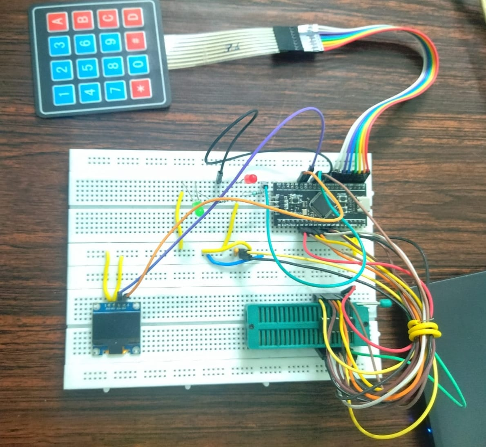
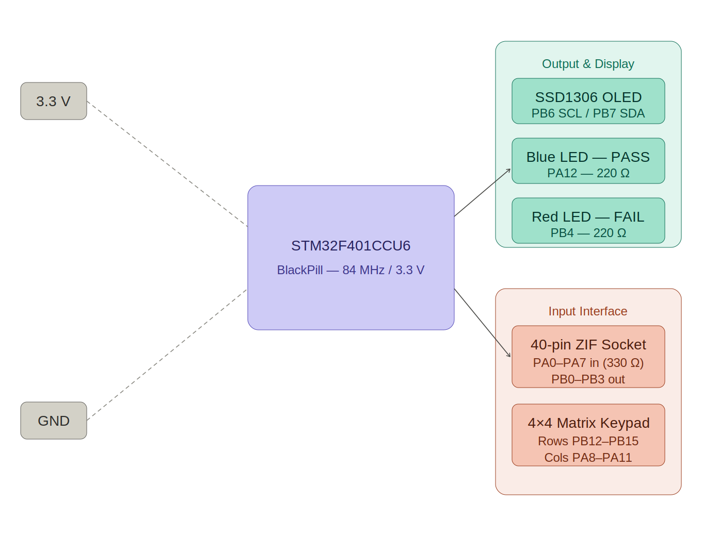
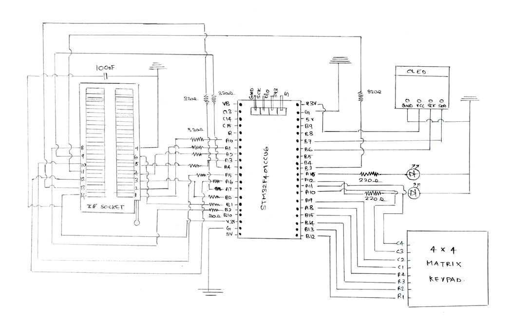
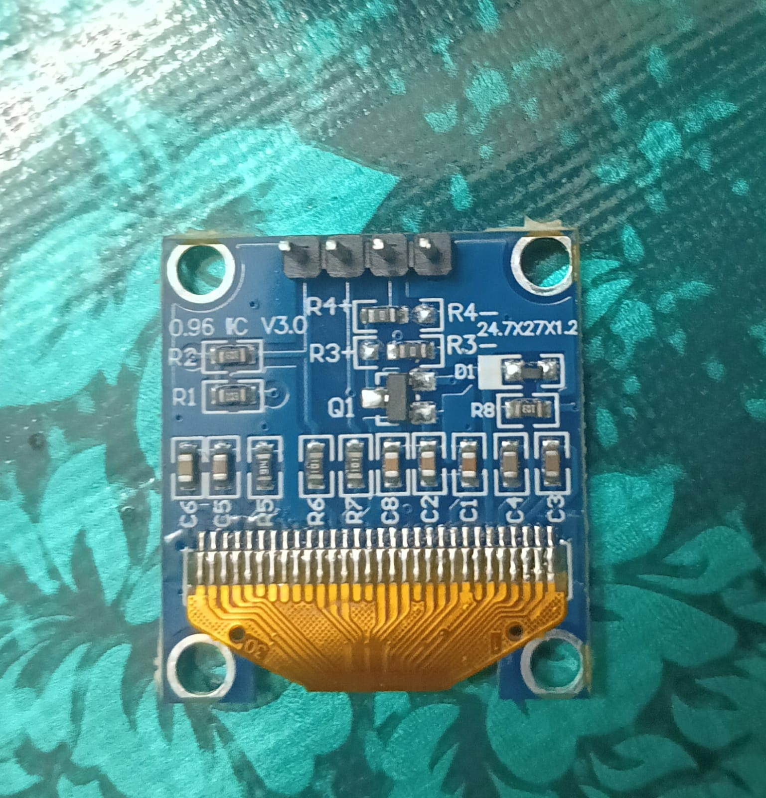
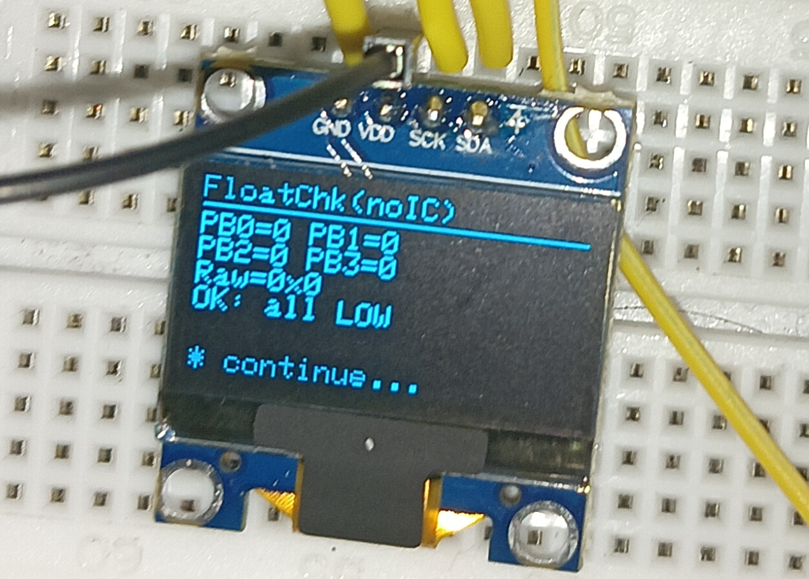
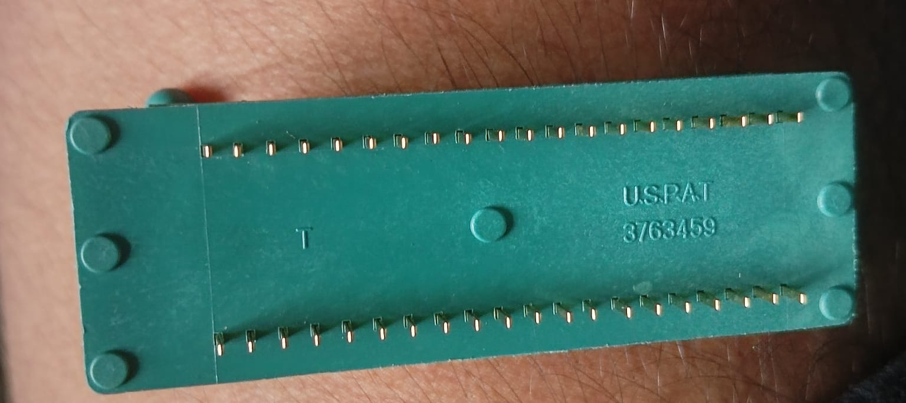

# Digital IC Tester for 74HC-Series Logic ICs using STM32F401CCU6


---

## Overview

This project implements a **Digital IC Tester** capable of automatically testing multiple **74HC-series digital logic ICs** using an **STM32F401CCU6 (BlackPill)** microcontroller.

The tester automatically applies logic input combinations, reads the IC outputs, compares them against the expected truth tables, and displays the result on a **128×64 SSD1306 OLED display**. A **40-pin ZIF socket** enables quick IC insertion and removal, while dedicated **PASS** and **FAIL** LEDs provide immediate visual feedback.

The firmware was developed using the **Arduino IDE** with the **STM32duino (Arduino Core for STM32)** framework.

---

# Prototype

<p align="center">

</p>

Complete hardware prototype consisting of the STM32F401CCU6 BlackPill, SSD1306 OLED display, 40-pin ZIF socket, 4×4 matrix keypad, and PASS/FAIL indicator LEDs.

## 🎥 Project Demonstration

<p align="center">

➡️ **[Watch the Digital IC Tester Demo](https://youtu.be/q8Rz96li0B0)**

</p>

---

# Project Highlights

- STM32F401CCU6 (BlackPill) based Digital IC Tester
- Supports multiple 74HC-series logic ICs
- Interactive OLED-based menu system
- 128×64 SSD1306 OLED user interface
- 4×4 Matrix Keypad for IC selection
- 40-pin ZIF Socket for quick IC insertion/removal
- Automatic truth-table verification
- PASS / FAIL LED indication
- Floating pin detection
- Wiring verification mode
- Row-by-row debugging mode
- Standalone operation (no Serial Monitor required)
- Modular firmware architecture using function pointers for easy expansion

---

# Supported ICs

| IC | Description |
|----|-------------|
| 74HC00 | Quad 2-Input NAND Gate |
| 74HC02 | Quad 2-Input NOR Gate |
| 74HC04 | Hex Inverter |
| 74HC08 | Quad 2-Input AND Gate |
| 74HC32 | Quad 2-Input OR Gate |
| 74HC86 | Quad 2-Input XOR Gate |
| 74HC138 | 3-to-8 Line Decoder |
| 74HC245 | Octal Bus Transceiver |

---

# System Architecture

<p align="center">

</p>

---

# Hardware Schematic

<p align="center">

</p>

The complete hardware schematic showing the STM32F401CCU6 interfaced with the 40-pin ZIF socket, SSD1306 OLED display, 4×4 matrix keypad, and PASS/FAIL indicator LEDs.

---

# Specifications

| Item | Value |
|------|-------|
| Microcontroller | STM32F401CCU6 (BlackPill) |
| Clock Frequency | 84 MHz |
| Operating Voltage | 3.3 V |
| Display | SSD1306 OLED (128×64, I²C) |
| Input Interface | 4×4 Matrix Keypad |
| Test Socket | 40-pin ZIF Socket |
| Supported Logic Family | 74HC Series |
| Development Environment | Arduino IDE + STM32duino |

---

# Components

| Component | Specification | Qty |
|-----------|--------------|-----|
| Microcontroller | STM32F401CCU6 (BlackPill) | 1 |
| OLED Display | SSD1306, 128×64, I2C (0x3C) | 1 |
| Matrix Keypad | 4×4, 16-key | 1 |
| ZIF Socket | 40-pin, DIP | 1 |
| LED (PASS) | Blue, 5 mm | 1 |
| LED (FAIL) | Red, 5 mm | 1 |
| Resistors (IC interface) | 330 Ω | 12 |
| Resistors (LED limiting) | 220 Ω | 2 |
| Decoupling Capacitor | 100 nF ceramic | 1 |
| 74HC-series ICs | 00, 02, 04, 08, 32, 86, 138, 245 | as needed |

---

# Pin Mapping

| Peripheral | STM32 Pin |
|------------|-----------|
| OLED SCL | PB6 |
| OLED SDA | PB7 |
| Keypad Rows | PB12 – PB15 |
| Keypad Columns | PA8 – PA11 |
| IC Input Lines | PA0 – PA7 |
| IC Output Lines | PB0 – PB3 |
| PASS LED | PA12 |
| FAIL LED | PB4 |

---

# Working Principle

1. Insert a supported IC into the 40-pin ZIF socket.
2. Select the IC using the keypad.
3. STM32 configures the GPIO pins.
4. Test vectors are automatically applied to the IC.
5. Output responses are sampled after a 500 µs propagation delay to ensure stable logic levels.
6. Results are compared against stored truth tables.
7. PASS or FAIL is displayed on the OLED.
8. Corresponding status LED is illuminated for 3 seconds.
9. The tester returns to the main menu for the next IC.

---

# Debug Features

## Preliminary Floating-Pin Check

Before executing the functional test, the firmware performs a preliminary output-state check. If all monitored outputs read HIGH, the system displays a warning indicating a possible floating output or pull-up condition. This warning is advisory only — the tester continues with the complete truth-table verification sequence to determine the actual functional status of the IC.

---

## Wiring Verification

Sequentially drives each of the eight input pins HIGH one at a time while keeping the rest LOW, then displays the raw output register on the OLED. Useful while assembling or troubleshooting the tester without any external equipment.

---

## Row-by-Row Debugging

Displays for every truth-table entry:

- IC Name
- Applied Input Pattern (8-bit)
- Expected Output (4-bit)
- Actual Output (4-bit)
- ROW OK / ROW FAIL verdict

Execution pauses for a keypress after each row, enabling step-by-step verification.

---

# Hardware Gallery

## OLED User Interface

<p align="center">

</p>

---

## OLED in Operation

<p align="center">

</p>

---

## 40-pin ZIF Socket

<p align="center">

</p>

---

# Project Structure

```text
STM32-Digital-IC-Tester
│
├── firmware
│   └── STM32_Digital_IC_Tester.ino
│
├── hardware
│   ├── block_diagram.png
│   └── circuit_diagram.png
│
├── images
│   ├── breadboard_setup.jpeg
│   ├── oled_front.jpeg
│   ├── oled_working.jpeg
│   └── zif_socket.jpeg
│
├── report
│   └── Digital_IC_Tester_Report.pdf
│
├── README.md
└── .gitignore
```

---

# Dependencies

Install the following Arduino libraries before compiling the project:

- **Adafruit GFX Library** — by Adafruit (Arduino Library Manager)
- **Adafruit SSD1306 Library** — by Adafruit (Arduino Library Manager)
- **Keypad Library** — by Mark Stanley, Alexander Brevig (Arduino Library Manager)
- **Wire Library** — included with the STM32duino Arduino Core (no installation needed)

Also install the **STM32duino Arduino Core** via Arduino Board Manager (search: "STM32" by STMicroelectronics).

---

# Applications

- PCB repair and QA — rapid go/no-go verification of 74HC ICs before board assembly
- Electronics laboratory experiments — teaching truth tables and logic gate behaviour interactively
- Procurement inspection — detection of counterfeit or out-of-spec ICs
- Field servicing — portable tester powered via USB without laptop or UART dependency
- Embedded systems education
- Expandability — the 40-pin ZIF socket and modular IC database can accommodate a wide range of DIP packages with minor firmware additions

---

# Results

The Digital IC Tester successfully verified the logical functionality of all supported 74HC-series ICs by comparing measured outputs against predefined truth tables.

The tester provides:

- Automatic PASS/FAIL indication
- OLED-based user feedback
- Step-by-step debugging utilities
- Wiring verification
- Floating pin detection

The modular firmware architecture allows additional ICs to be supported with minimal code modifications.

---

# Future Improvements

- Support for additional 74HC-series ICs
- Support for 16-bit and 32-bit digital logic devices
- Automatic IC identification
- EEPROM-based truth-table storage
- USB/UART logging
- TFT display interface
- PCB implementation
- Battery-powered portable version

---

# Authors

- **Sooraj K R** — B241226EC
- **Soorya Narayan S** — B241229EC
- **Soupayan Dutta** — B241230EC

Department of Electronics and Communication Engineering  
**National Institute of Technology Calicut**  
EC2092E — Microcontroller Lab | Academic Year 2025–26

---

## Repository Maintainer

**Soorya Narayan S**

GitHub: https://github.com/soorya-creator

---

# References

- STMicroelectronics, STM32F401xC/xE Reference Manual (RM0368), Rev. 5, 2020
- STMicroelectronics, STM32F401CC Datasheet, Rev. 8, 2019
- Texas Instruments, 74HC/HCT Logic Family Datasheet Collection, 2022
- Solomon Systech, SSD1306 OLED Driver Datasheet, Rev. 1.1, 2008
- Adafruit Industries, Adafruit SSD1306 Library
- STM32duino (Arduino Core for STM32)
- Keypad Library for Arduino